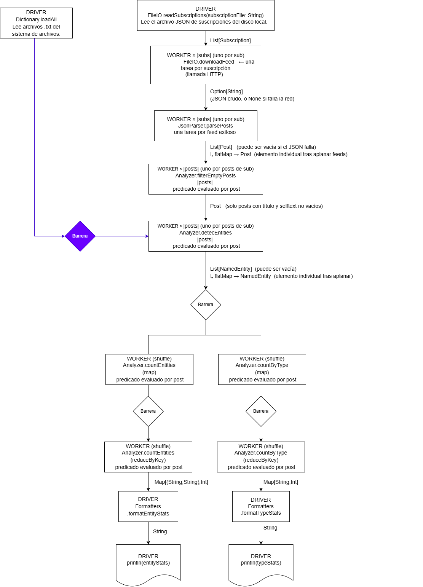

# Informe: Pipeline NER como Grafo de Dependencias y Abstracciones Spark

---

## a) Grafo de dependencias del pipeline

El pipeline es esencialmente lineal, con una bifurcación al final para los dos cómputos de estadísticas independientes. Cada arista del grafo lleva el tipo Scala del dato que fluye entre pasos. Se indica además si cada paso lo ejecuta el **driver** (proceso central) o un **worker** (proceso distribuido).

**Tabla de tipos por arista:**

| Conexión (origen → destino)                     | Tipo Scala                                                  |
|-------------------------------------------------|-------------------------------------------------------------|
| readSubscriptions → downloadFeed                | `List[Subscription]`                                        |
| downloadFeed → parsePosts                       | `Option[String]`                                            |
| parsePosts → filterEmptyPosts                   | `List[Post]` por feed / `Post` tras aplanar                 |
| filterEmptyPosts → detectEntities               | `Post`                                                      |
| Dictionary.loadAll → detectEntities (broadcast) | `List[NamedEntity]`                                         |
| detectEntities → reducciones                    | `List[NamedEntity]` por post / `NamedEntity` tras aplanar   |
| countEntities → sort + take                     | `Map[(String, String), Int]`                                |
| countByType → formatTypeStats                   | `Map[String, Int]`                                          |
| sort + take → formatEntityStats                 | `List[((String, String), Int)]`                             |

---

## b) Correspondencia con abstracciones de Spark

| Paso del pipeline         | Abstracción Spark    | Justificación                                                                                                    |
|---------------------------|----------------------|------------------------------------------------------------------------------------------------------------------|
| Descargar feed            | `map`                | Cada `Subscription` produce exactamente un `Option[String]` |
| Parsear posts             | `flatMap`            | Cada feed puede producir 0 posts (si el JSON es inválido) o N posts (uno por entrada en `children`).             |
| Filtrar posts vacíos      | `filter` = `flatMap` | Cada `Post` produce 0 o 1 resultados según el predicado. (Nota: filter es un `flatMap`) degenerado.                             |
| Detectar entidades        | `flatMap`            | Cada post produce 0 entidades (si no hay coincidencias) o N (una por entidad encontrada).                        |
| Contar entidades          | `map` + `reduceByKey`        | Equivale a `rdd.map(e => ((e.entityType, e.text), 1)).reduceByKey(_ + _)`.                                       |
| Contar por tipo           | `map` + `reduceByKey`          | Equivale a `rdd.map(e => (e.entityType, 1)).reduceByKey(_ + _)`.                                                 |
| Ranking (sort + top-K)    | **No encaja**        | Ver análisis debajo.                                                                                             |
| Leer suscripciones        | **No encaja**        | Ver análisis debajo.                                                                                             |
| Cargar diccionario        | **No encaja**        | Ver análisis debajo.                                                                                             |

### Pasos que no encajan en ninguna de las tres abstracciones

**Leer suscripciones y cargar diccionario** son acciones de inicialización del driver sobre I/O local. No operan sobre ningún RDD distribuido: producen los datos de entrada con los que se construirá el RDD. No son transformaciones en el sentido de Spark; son operaciones previas al plan de ejecución. El diccionario se distribuiría a los workers mediante un `Broadcast[List[NamedEntity]]`, no como una transformación de datos.

**Ranking (sortBy + take(K))** requiere un ordenamiento _global_ de todos los elementos. Para determinar el top-K es necesario comparar elementos que residen en diferentes nodos del cluster: ningún worker puede saber si su elemento local califica entre los mejores sin ver los elementos de todos los demás. En Spark existe `sortBy` (transformación _wide_ con shuffle global) y la acción `top(k)` (basada en un heap distribuido), pero ninguno de estos encaja en `map`, `flatMap` ni `reduceByKey`. La diferencia fundamental con `reduceByKey` es que `reduceByKey` combina valores _de la misma clave_, mientras que el ranking combina y compara valores _entre claves distintas_ para producir un orden global.

---

## c) Barreras de sincronización

En Spark, las transformaciones **narrow** permiten a cada worker operar sobre su partición de forma completamente independiente (sin mover datos entre nodos). Las transformaciones **wide** requieren un _shuffle_: todos los workers deben completar su fase de emisión antes de que pueda comenzar la fase de reducción. Esto constituye una barrera de sincronización.

### Pasos que son barreras (requieren sincronización global)

**`Analyzer.countEntities` (reduceByKey):** Todos los workers que ejecutan `detectEntities` deben haber terminado y emitido sus pares `((tipo, nombre), 1)` antes de que pueda comenzarse a sumar. La cuenta final de una entidad como `("ProgrammingLanguage", "Scala")` depende de las ocurrencias detectadas en _todos_ los posts de _todos_ los feeds, que están distribuidos en distintos nodos.

**`Analyzer.countByType` (reduceByKey):** Ocurre la misma situación. El total de entidades de tipo `Person`, por ejemplo, requiere acumular los conteos parciales de todos los workers.

**Ranking (sortBy + take(K)):** Constituye una segunda barrera, que además depende de que `countEntities` haya finalizado. Para ordenar globalmente el mapa de frecuencias se requiere un shuffle completo: los workers intercambian datos para redistribuirlos según la clave de ordenamiento antes de producir el resultado final.

### Pasos que se ejecutan de forma independiente (sin barrera)

**Descargar feed:** La descarga de `/r/python.json` es completamente independiente de la de `/r/scala.json`. Pueden ejecutarse en paralelo en distintos workers sin ninguna coordinación.

**Parsear posts:** Cada worker parsea su propio JSON. No hay dependencia entre feeds.

**Filtrar posts:** El predicado de filtrado se evalúa post a post. La decisión de retener o descartar un post no depende del estado de ningún otro.

**Detectar entidades:** Cada worker analiza su propio post contra el diccionario. Como el diccionario es de solo lectura y está disponible como broadcast en todos los nodos, la tarea de cada post no necesita coordinar con ninguna otra.

### Nota sobre la carga del diccionario

`Dictionary.loadAll` no es una barrera de shuffle - representa una _dependencia de datos secuencial_: debe completarse en el driver antes de que pueda broadcastearse y antes de que los workers comiencen la fase de detección. Es una dependencia secuencial, no una barrera entre workers.

---

## d) Restricciones sobre las funciones en entornos distribuidos

### 1. Serialización

Toda función pasada a una transformación de Spark es **serializada en el driver, enviada por la red a cada worker, y deserializada para su ejecución**. Esto impone que:

- La closure debe ser serializable (compatible con Java Serialization).
- Todo objeto capturado por la closure también debe ser serializable. Si `detectEntities` captura el diccionario `List[NamedEntity]`, entonces `NamedEntity`, `Person`, `Organization`, `ProgrammingLanguage`, etc. deben poder serializarse.
- **Problema concreto en el código actual:** Las subclases de `NamedEntity` son clases regulares de Scala, no `case class`. Las clases regulares no implementan `java.io.Serializable` automáticamente. En Spark, esto generaría un `NotSerializableException` en tiempo de ejecución al intentar broadcastear el diccionario. Una solución es añadir `extends Serializable` a la jerarquía.
- **Objetos intrínsecamente no serializables:** `scala.io.Source`, conexiones de red abiertas (`java.net.Socket`), descriptores de archivo (`FileInputStream`), etc. no pueden serializarse. Algo para añadir sobre esto es que, si alguna closure los capturara, fallaría en tiempo de ejecución, no en compilación, lo que dificulta la detección del error.

### 2. Ausencia de estado compartido mutable entre workers

En un cluster Spark, cada worker corre en su propia JVM en una máquina física diferente. **No existe memoria compartida entre workers**. Solo puede existir entre workers y drivers **únicamente** mediante mecanismos explícitos como `Accumulator` (para agregación distribuida) o `Broadcast` (para datos de solo lectura).

Si una closure captura una variable mutable (`var`) del driver, cada worker recibe una **copia serializada** del valor en el momento de la distribución de la tarea. Las modificaciones que haga el worker a esa copia son completamente locales a su JVM: nunca se propagan hacia el driver ni hacia otros workers. Código que funciona correctamente en ejecución local (donde todos los "workers" comparten el mismo heap) produce resultados incorrectos o silenciosamente ignorados en Spark. Por ejemplo, si se intentara acumular un contador de entidades detectadas en una `var` del driver desde dentro de un `flatMap`, ese contador nunca se actualizaría desde fuera del driver. Para este patrón, Spark provee `LongAccumulator`, que tiene semántica específica para agregación distribuida segura.

### 3. Idempotencia

Spark puede **re-ejecutar tareas fallidas** en otro nodo (por fallo de hardware o de red) y, en modo especulativo, **ejecutar la misma tarea concurrentemente en múltiples nodos**. Por este motivo, las funciones deben ser **idempotentes**: ejecutar la misma función múltiples veces sobre el mismo input debe producir el mismo resultado observable.

Efectos secundarios problemáticos identificados en el código actual:

- **`JsonParser.parsePosts` llama a `println` en el bloque `catch`:** En entorno distribuido, este output aparece en los logs del worker, no en la consola del driver. Si Spark re-ejecuta la tarea, el mensaje se duplica en los logs.

- **`FileIO.downloadFeed` realiza una llamada HTTP:** Si Spark re-ejecuta la tarea por un fallo transitorio, se realiza una segunda petición HTTP al servidor de Reddit. Esto es problemático si la API tiene rate-limiting, si el recurso no es idempotente, o si el contenido puede haber cambiado entre ejecuciones (introduciendo no-determinismo en el resultado final).

### 4. Determinismo

Siguiendo el problema de tareas fallidas, las funciones deben producir el mismo resultado dado el mismo input para que la re-ejecución produzca resultados coherentes. Por ejemplo, el acceso a recursos externos mutables —APIs de Reddit que pueden retornar posts diferentes en dos llamadas distintas, o archivos en disco que pueden haber sido modificados— introduce no-determinismo que puede causar inconsistencias difíciles de depurar: la re-ejecución de una tarea fallida podría incorporar datos distintos a los de la ejecución original, corrompiendo el resultado final de forma silenciosa.